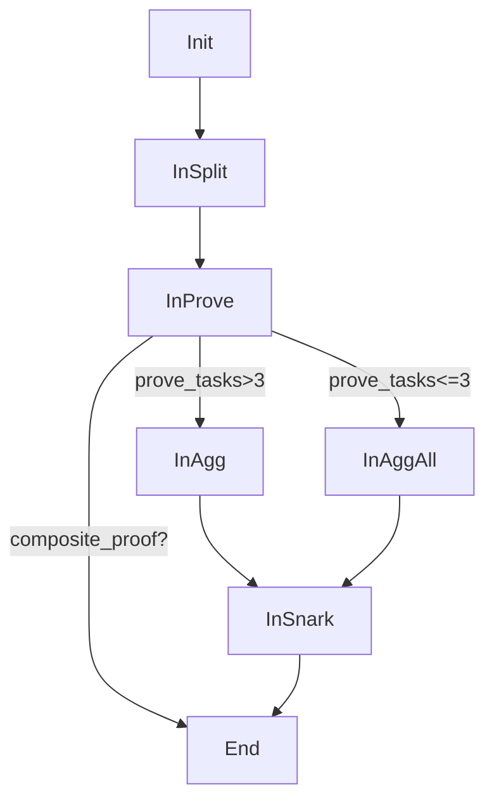
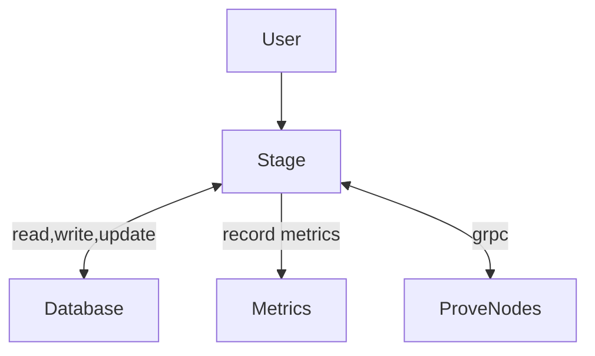

# zkm-prover
A parallel proving service for [ZKM](https://github.com/zkMIPS/zkm).

## Stage Workflow




| Stage    | Input        | Action                                  | In Disk/Memory |
|----------|--------------|-----------------------------------------|----------------|
| Init     | GenerateTask | gen_split_task                          | Memory         |
| InSplit  | SplitTask    | gen_prove_task                          | Disk           |
| InProve  | ProveTask    | gen_agg_task or gen_agg_all_task or END | Memory         |
| InAgg    | AggTask      | gen_snark_task                          | Memory         |
| InAggAll | AggAllTask   | gen_snark_task                          | Memory         |
| InSnark  | SnarkTask    | END                                     | Memory         |


This repository consists of a stage service and multiple prover nodes. Each node can run a proving task. 



For the Stage, it provides the functions as below.

| Method         | In Disk/Database | Functionality                     |
|----------------|------------------|-----------------------------------|
| generate_proof | Disk, Database   | Submit a proof generation request |  
| get_status     | Database        | Query the task status            | 

For each ProverNodes, it begins to serve after registering to the Stage, and provides the functions as below.

| Method          | In Disk/Memory | Functionality                                                            |
|-----------------|----------------|--------------------------------------------------------------------------|
| split_elf       | Disk       | Split the ELF program into multiple segments, dump the segment into disk |  
| prove           | Memory         | Prove the batches                                                        |
| aggregate       | Memory         | Aggregate the two batch proofs                                           |
| aggregate_all   | Memory         | Aggregate the multiple batch proofs                                      |
| snark_proof     | Memory         | Generate the SNARK proof of the stark verifier on large field            |
| get_status      | Memory         | Query the prover's status, Idle or Computing                             | 
| get_task_result | Memory         | Query the task status, returning 200 or else.                            | 

A ProverNode can be an instance to run `prove`, `aggregate`, `aggregate_all` or `snark_proof`. Consider that, the `snark_proof` can not utilize the GPU accelerator,
it's necessary to schedule different instance onto different machine by its resource requirement to realize hardware affinity for better machine utilization.

Specially, `split_elf` reads the ELF from the disk, which is written by the `Stage`'s `GenerateTask`, this means its corresponding `ProverNode` should be able to access the `Stage`'s disk. Currently, the shared filesystems, like AWS S3 or NFS, are employed to make it possible. 
This additional dependency of the `proof-service` can be practical in short-term, but it's best to transit the data by `GRPC` directly in the long-term[TODO]. 

## Deployment

### Deployment Prover

You can only deploy the provider service for other stage services to call

Configure
```
# Replace it with your IP address and port
addr = "0.0.0.0:50000"
prover_addrs = []
# The NFS file system path / S3 must be used, and all node configurations must be the same
base_dir = "/tmp/zkm/test/test_proof"
```

Start
```
export RUST_LOG=info; nohup ./target/release/proof-service --config ./service/config/prover.toml > prover.out &
```

### Deployment Stage

Configure
```
# Replace it with your IP address and port
addr = "0.0.0.0:50000"
# All prover node 
prover_addrs = ["192.168.0.1:50000", "192.168.0.2:50000"]
# The NFS file system path / S3 must be used, and all node configurations must be the same
base_dir = "/tmp/zkm/test/test_proof"
```

Start
```
export RUST_LOG=info; nohup ./target/release/proof-service --config ./service/config/stage.toml --stage > stage.out &
```
